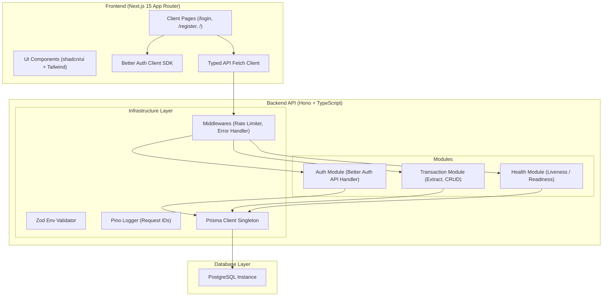

# Vessify Personal Finance Transaction Extractor

An enterprise-grade, highly secure, modular monolithic personal finance transaction parser and extractor. Built with strict organization-level data isolation, token-based authentication, and robust cursor-based pagination.

---

## 🚀 Key Standout Features (For Interviewers)

1. **True Multi-Tenancy & Data Isolation (Dual-Key Scoping)**: 
   Every transaction record is coupled with both `userId` and `organizationId`. The API queries explicitly filter by the user's active `organizationId` from the context validated in the auth middleware. Even if a user alters API request payloads, they cannot access or modify transactions belonging to other users or organizations.
2. **Modular Monolith Architecture**: 
   The backend follows a domain-driven modular structure (`auth`, `transactions`, `health`) powered by Hono and Prisma. Infrastructure dependencies like configuration validation, request correlation ID logging (Pino), and custom rate-limiters are housed in standard sub-systems.
3. **Multi-Strategy Parsing with Weighted Confidence**: 
   The extraction engine runs multiple parse strategies in parallel (labelled format, arrow format, and inline format), grading the parsing success with a weighted confidence score. A transaction is only saved if it meets the minimum threshold (30%).
4. **Resilient Pagination (Cursor-Based)**: 
   Pagination uses a composite cursor on `(createdAt, id)` rather than offset pagination. This prevents records from skipping or duplicating when new transactions are parsed in real time.
5. **Fail-Fast Environment validation**: 
   System configurations are validated at boot using a strict Zod schema. If a key variable is missing or malformed, the process immediately crashes with a clean visual trace.

---

## 🏗 System Architecture



### Module Folder Structure

```
assignment/
├── backend/
│   ├── src/
│   │   ├── modules/
│   │   │   ├── auth/          # Better Auth config, middleware & router
│   │   │   ├── transactions/  # Extraction, parser, service & routes
│   │   │   └── health/        # Liveness & Readiness checks
│   │   ├── infrastructure/
│   │   │   ├── database/      # Prisma singleton & disconnect hooks
│   │   │   ├── logger/        # Pino structured logging
│   │   │   ├── middleware/    # Global handlers (CORS, Rate Limit, Errors)
│   │   │   └── config/        # Zod environment schemas
│   │   └── shared/            # Types, constants & error structures
│   └── tests/                 # Vitest suites (Auth, Parser, Isolation)
├── frontend/
│   ├── src/
│   │   ├── app/               # Next.js page routing
│   │   ├── components/        # Extractor, history table & shadcn/ui components
│   │   └── lib/               # Better Auth Client SDK, custom API caller
└── docker-compose.yml         # Local container orchestration
```

---

## 🔐 Better Auth Integration & Multi-Tenancy

We leverage **Better Auth** with its **organization plugin** to build our multi-tenant hierarchy:
* **Automatic Workspace Creation**: On registration, a database lifecycle hook intercepts the user creation and generates a default "Personal Workspace" organization. The registering user is assigned the role of `owner` for that organization.
* **Dual-Key Scoping**: Transactions are stored with a direct reference to the active `organizationId`. All fetch queries verify both user membership and organization scoping:
  ```typescript
  where: {
    organizationId: auth.organizationId,
    userId: auth.userId
  }
  ```
* **Cookie-Based Sessions**: Session verification occurs transparently in the `authGuard` middleware. The client SDK receives an HTTP-only token cookie, ensuring defenses against XSS-based session hijacking.

---

## 🚦 Quick Setup

### Method A: Docker Compose (Recommended)
You can launch the entire stack (Database, Hono Backend, Next.js Frontend) in one command:
```bash
docker compose up --build
```
* Frontend runs on `http://localhost:3000`
* Backend runs on `http://localhost:3001`
* PostgreSQL runs on `localhost:5432`

---

### Method B: Local Execution (Manual)

#### 1. Setup PostgreSQL Database
Make sure you have a running PostgreSQL database, and copy/create a `.env` in the backend:
```bash
cp backend/.env.example backend/.env
```
Update `DATABASE_URL` in `backend/.env` with your Postgres connection string.

#### 2. Run Database Migrations & Generator
```bash
cd backend
npm install
npx prisma db push
```

#### 3. Start Backend Dev Server
```bash
npm run dev
```

#### 4. Configure & Start Frontend
In a new terminal window:
```bash
cd frontend
cp .env.local .env
npm install
npm run dev
```

---

## 🧪 Running Tests

A comprehensive suite of **18 unit and integration tests** covers auth validation, parser behavior on all samples, and data isolation.

To execute tests:
```bash
cd backend
npm run test
```

---

## 📝 Parsing Samples

Copy and paste these directly into the extractor UI to test:

### Sample 1: Labelled Format
```text
Date: 11 Dec 2025
Description: STARBUCKS COFFEE MUMBAI
Amount: -420.00
Balance after transaction: 18,420.50
```

### Sample 2: Arrow Format
```text
Uber Ride * Airport Drop
12/11/2025 → ₹1,250.00 debited
Available Balance → ₹17,170.50
```

### Sample 3: Messy Inline Format
```text
txn123 2025-12-10 Amazon.in Order #403-1234567-8901234 ₹2,999.00 Dr Bal 14171.50 Shopping
```
# finance
